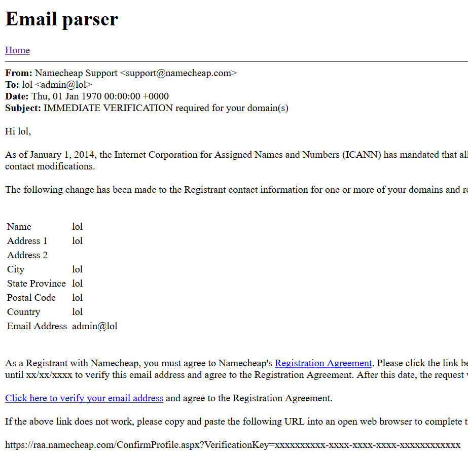

# Online email parser

A companion project for [tcpbin](https://github.com/ecx86/tcpbin).

This is a simple Flask webapp that just parses raw email data and renders a webpage to display it. Although it doesn't strip dangerous tags like `<script>` or ``, these are mitigated by enforcing an extremely strict Content Security Policy (`default-src 'none'`).

## Try it online
https://tcpb.in:5000

## Setup
```
git clone https://github.com/ecx86/email-parser
cd email-parser
sudo pip3 install -r requirements.txt
export FLASK_APP=app.py
python3 -m flask run
```

Note that it's better to run it under wsgi if you're hosting it permanently.

## Example


```
From: "Namecheap Support" <support@namecheap.com>
To: "lol" <admin@lol>
Date: Thu, 1 Jan 1970 00:00:00 +0000 (UTC)
Subject: IMMEDIATE VERIFICATION required for your domain(s)
Content-Type: text/html;
Content-Transfer-Encoding: quoted-printable

Hi lol,<br /><br />=0D
=0D
As of January 1, 2014, the Internet Corporation for Assigned Names and Numb=
ers (ICANN) has mandated that all ICANN-accredited registrars verify WHOIS =
contact information for all new domain registrations and Registrant contact=
 modifications.<br /><br />=0D
=0D
The following change has been made to the Registrant contact information fo=
r one or more of your domains and requires verification:=0D
<br /><br /><br />=0D
=0D
<table>=0D
<tr>=0D
<td>Name<td/>=0D
<td>lol<td/>=0D
</tr>=0D
<tr>=0D
<td>Address 1<td/>=0D
<td>lol<td/>=0D
</tr>=0D
<tr>=0D
<td>Address 2<td/>=0D
<td><td/>=0D
</tr>=0D
<tr>=0D
<td>City<td/>=0D
<td>lol<td/>=0D
</tr>=0D
<tr>=0D
<td>State Province<td/>=0D
<td>lol<td/>=0D
</tr>=0D
<tr>=0D
<td>Postal Code<td/>=0D
<td>lol<td/>=0D
</tr>=0D
<tr>=0D
<td>Country<td/>=0D
<td>lol<td/>=0D
</tr>=0D
<tr>=0D
<td>Email Address<td/>=0D
<td>admin@lol<td/>=0D
</tr>=0D
</table>=0D
<br /><br />=0D
=0D
 =0D
As a Registrant with Namecheap, you must agree to Namecheap's <a href=3D"ht=
tps://www.namecheap.com/legal/domains/registration-agreement.aspx">Registra=
tion Agreement</a>. Please click the link below to verify the Registrant em=
ail address and explicitly consent to the terms of our Registration Agreeme=
nt. You have until xx/xx/xxxx to verify this email address and agree to the=
 Registration Agreement. After this date, the request will be canceled and =
no changes to the Registrant contact details will be processed.<br /><br />=
=0D
=0D
<a href=3D"https://raa.namecheap.com/ConfirmProfile.aspx?VerificationKey=3D=
lol">Click here to verify your email addre=
ss</a> and agree to the Registration Agreement.  <br /><br />=0D
=0D
If the above link does not work, please copy and paste the following URL in=
to an open web browser to complete the verification process:<br /><br />=0D
=0D
https://raa.namecheap.com/ConfirmProfile.aspx?VerificationKey=xxxxxxxxxx-xx=
xx-xxxx-xxxx-xxxxxxxxxxxx=0D
<br /><br />=0D
=0D
Once you click the link, your Registrant email address will be instantly ve=
rified for the following domain(s):<br /><br />=0D
=0D
lol=0D
<br /><br />=0D
=0D
=0D
=0D
Best regards, <br />=0D
Team Namecheap=
```
